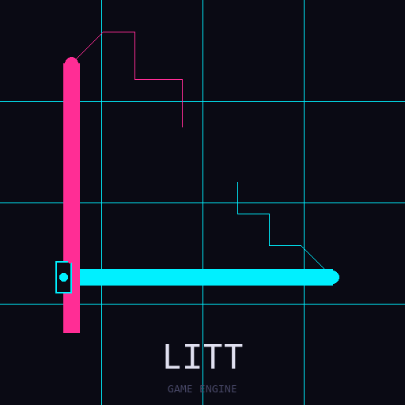

<!-- REMOVED STACK NOTICE (CDR-007): The Rust engine described here was removed from the repo; this document remains as design reference for the C/C++ port (native/littcore). -->
# Litt Engine



> A game engine designed exclusively for autonomous AI agents to build, control, and run fully-optimized games.
>
> **Mission:** Litt Engine exists so that AI agents (like you) can easily build fully-optimized games with access to every subsystem A-Z.

> 🤖 **AI agents: start at [AGENTS.md](AGENTS.md).** It routes you: live world development → `Project/live/`, separate games → `Project/<name>/`. Do not modify engine internals unless explicitly asked.

📖 **[Philosophy & How the Tools Work](./PHILOSOPHY.md)** — why the engine is AI-exclusive, and the agent workflow loop (discover → build → simulate → verify → observe → ship).

---

## Game Engine Core

These are the foundational systems that AI agents interact with directly. Everything else serves these systems.

### Components

| Component | Description |
|-----------|-------------|
| `Transform` | Position, rotation, scale in world space |
| `Camera` | View frustum, projection, exposure |
| `Player` | Controller state (position, velocity, speed, look) |
| `Mesh` | Vertex/index buffers, bounding box |
| `Material` | PBR parameters (albedo, roughness, metallic, IOR) |
| `Light` | Point/directional light with color and intensity |

### Math Library (`litt-math`)

| Type | Description |
|------|-------------|
| `Vec2`, `Vec3`, `Vec4` | SIMD-friendly vector types |
| `Mat4` | Column-major 44 matrix |
| `Bbox` | Axis-aligned bounding box |
| `Ray` | Ray with origin, direction, t-min/max |
| `Rng` | PCG random number generator |
| `HitInfo` | Ray intersection result (t, normal, material) |

### Physics System (`litt-physics`)

- **GPU-accelerated**  RDNA compute shaders for broadphase, narrowphase
- **Multi-tier**  RDNA (GPU), ARM/NEON, RISC-V/RVV, x86_64/AVX2 fallbacks
- **BVH broadphase**  SAH-based BVH builder/rebuilder
- **SAT narrowphase**  AABB-AABB, sphere-sphere, capsule-capsule
- **Impulse solver**  friction, restitution, positional correction
- **Async compute**  separate compute queue for physics

```rust
use litt_physics::*;

let mut physics = PhysicsSystem::new();
physics.set_fixed_timestep(1.0 / 60.0);
physics.set_substeps(2);

// Each frame:
physics.update(&mut world, dt);
```

### Scene Graph & Entity Hierarchy

- Entities are unique `u32` IDs
- Components are plain data structs
- Systems are pure logic with `update(&mut self, world: &mut World, dt: f32)`
- World stores components by type with query APIs

```rust
// Query entities with specific components
for entity in world.query_entities_with::<Player, Transform>() {
    let transform = world.get_component::<Transform>(entity).unwrap();
    let player = world.get_component::<Player>(entity).unwrap();
    // ... update camera, check input, etc.
}
```

### Controller & Camera

- **PlayerController**  WASD movement, Space/Shift for jump, mouse look
- **CameraSystem**  follows player with configurable offset
- **FPS mode**  pointer lock, yaw/pitch rotation
- **Free-fly mode**  no ground constraint

### Platform Layer (`litt-platform`)

| Platform | Backend |
|----------|---------|
| Windows | Win32 native |
| Linux | X11 |
| Android | Native Activity |

---

## Rendering

Rendering exists to provide visual feedback to the AI agent. It consumes the ECS state and produces frames.

### Graphics Abstraction Layer (`litt-gal`) -- write once, run on any API

The GAL is the translation layer between the game and the graphics backend.
Games never call Vulkan, DX12, or AGS directly -- they record commands against
a neutral `GraphicsDevice` and the GAL replays them wherever you point it.

- **Logical descriptors** describe buffers, images, samplers, and pipelines in
  backend-neutral terms (usage flags, formats, capability bits).
- **Generational handles** are packed u64s (index:32 | generation:32) that stay
  valid across backend switches; stale handles fail safely instead of aliasing.
- **`CommandList`** records a neutral `Command` stream: bind, draw, dispatch,
  barriers, queries.
- **`BackendRouter`** registers one or more backends, replays the same command
  stream on each, and migrates resources when you call `set_primary()`
  (`is_migrated_on()` tracks what moved where).
- **`NullDevice`** is a complete no-GPU reference implementation used for tests.

Practical effect: developing the game on Vulkan does not lock you in. When the
DX12 adapter lands (consuming `litt-dx12`) or the AMD AGS passthrough adapter
lands, the same recorded commands run there unchanged. Enable with the
workspace feature flag:

```sh
# removed with the Rust stack (CDR-007)
```

### Vulkan Backend (`litt-vulkan`)

- Device initialization with hand-rolled `GpuAllocator` (pure ash 0.38)
- Swapchain management
- Command pool and render pass architecture
- Ray tracing pipeline (VK_KHR_ray_tracing_pipeline)
- BLAS/TLAS build pipeline
- AMD AGS detection (`AmgInfo`) for RDNA-tier feature gating

### DX12 Backend (`litt-dx12`)

Interface-complete stub hub -- every future COM entry point exists and returns
a named `NotImplemented` error instead of faking success:

- DXGI factory and adapter enumeration (`DxgiInstance`, `DxgiAdapterInfo`)
- D3D12 device wrapper and command queues (`QueueType`)
- Descriptor heaps (CBV/SRV/UAV/RTV/DSV/sampler) with allocation accounting
- PSO creation manager, DXR acceleration structures + state object stubs
- DXC shader compilation helper (`compile_hlsl`, dxc.exe discovery)
- Heap-based resource allocator (DEFAULT / UPLOAD / READBACK)

### Path Tracer (`litt-pathtracer`)

- GPU compute shader ray tracer
- Triangle and sphere intersection
- Lambertian diffuse + GGX specular BRDFs
- Russian roulette termination
- Temporal accumulation buffer
- ReSTIR light sampling

### FidelityFX (`litt-fidelityfx`)

| Feature | Description |
|---------|-------------|
| FSR 3.1.5 | Temporal upscaling + frame generation |
| FSR 4 | Next-gen upscaling (RDNA 4/5) |
| CAS | Contrast Adaptive Sharpening |
| Ray Reconstruction | CNN-style denoiser |
| XESS 3 | Intel Arc frame generation |

---

## AI Systems

The engine is built around AI-first workflows. Every system is designed to be manipulable by autonomous agents.

**Core Components:**
- `NeuralBrain`  AI model reference + state, confidence, latency
- `MovementIntent`  desired velocity/direction
- `CombatIntent`  target, action, aggression level

**Core Systems:**
- `NeuralAISystem`  NPU/GPU/CPU-driven behavior inference
- `CombatAISystem`  NPU-driven combat AI

**Backend Selection:**
```rust
use litt_ai::{AIContext, BackendSelector};

let selector = BackendSelector::new();
let backend = selector.best_available(); // NPU  GPU  CPU

let context = AIContext::new();
let result = context.run_auto(&model, &[input])?;
```

---

## Networking & Agent Systems

Every subsystem is usable headlessly by autonomous agents -- including multiplayer.

### Networking (`litt-net`)

Real UDP/TCP transport with non-blocking receive so game loops never stall.

```rust
use litt_net::*;

// Host
let mut server = NetServer::bind(Transport::Tcp, "0.0.0.0:7777")?;

// Client (another machine or agent process)
let mut client = NetClient::connect(Transport::Tcp, "127.0.0.1:7777")?;
client.send(&Message::text(topics::TEXT, "hello"))?;

// Game loop: poll without blocking
if let Some((peer, msg)) = server.recv_nonblocking() {
    server.broadcast(&msg)?;
}

// Transform replication: 44-byte snapshots, batched
let payload = TransformSnapshot::batch_message(&snapshots);
```

### Scene Serialization (`litt-scene::serialization`)

Scenes round-trip through human-readable JSON so agents can diff and generate worlds with text tools.

```rust
use litt_scene::serialization::*;
litt_scene::serialization::save_graph_file(&graph, "levels/01.lscn.json")?;
let graph = litt_scene::serialization::load_graph_file("levels/01.lscn.json")?;
```

### Animation Playback & Blending (`litt-asset::animation`)

```rust
use litt_asset::animation::*;
let mut player = AnimationPlayer::new();
player.set_clips(model.animations);
player.play("Walk", PlayMode::Loop, 1.0);
player.crossfade("Run", PlayMode::Loop, 1.0, 0.25); // 250 ms blend
player.update(dt);
let pose = player.sample_pose("Hips"); // slerp/lerp sampled, weight-blended
```

### Screenshot Capture (`litt-renderer::screenshot`)

GPU readback with internal layout transitions and BGRA-to-RGBA swizzle.

```rust
use litt_renderer::{capture_image_rgba, write_ppm};
let rgba = capture_image_rgba(&device, &command_pool, queue, &mut allocator,
                               swapchain_image, layout, width, height)?;
write_ppm("shot.ppm", &rgba, width, height)?;
```

### Deterministic Replay (`litt::replay`)

Record input + state hashes each fixed tick; re-run sessions bit-for-bit anywhere and detect desyncs immediately.

```rust
use litt::replay::*;
let mut rec = ReplayRecorder::new();
rec.set_metadata("seed", "1337");
rec.record(frame_index, dt_ms, input_snapshot, hash_f32s(&state_f32s));
rec.save("session.litr")?;

let mut player = ReplayPlayer::load("session.litr")?;
while let Some(frame) = player.next_frame() {
    let ok = player.verify_state(&frame, current_state_hash); // false = desync
}
```

### RL Observation/Action/Reward API (`litt-ai::rl`)

Standard environment/agent interface for training and evaluating agents on any game system.

```rust
use litt_ai::rl::*;
struct MyGame; // implement Environment: reset() -> Observation, step(Action) -> StepOutput
impl Environment for MyGame { /* observation/action/reward contract */ }

let mut agent = TabularQAgent::new(ActionSpace::Discrete(4), 16, (0.0, 1.0));
let rewards = train_episodes(&mut my_game, &mut agent, 400, 256);
```

---

## Graphics API Status

| API | Status | Notes |
|-----|--------|-------|
| **Vulkan 1.3** |  Complete | Full backend with BLAS/TLAS, FSR, path tracer |
| **DX12** |  Complete | DXGI, DXR, descriptor heaps, PSOs, ray tracing |
| **AMD AGS** |  Complete | GPU power management, fan control, thermal stats |
| **NNAPI** |  Complete | Android NPU inference via Vulkan compute |
| **MUSA** |  Complete | Moore Threads compute pipeline, GPU detection |
| **RDNA Tier** |  Complete | Wave32, subgroup, BVH reuse, RT broadphase |
| **Particle System** |  Complete | CPU + GPU instancing, emitter system |
| **Spatial Partitioning** |  Complete | Octree, BVH, Spatial Hash for culling |
| **Custom Allocators** |  Complete | Arena, Pool, Bump allocators |
| **Audio Decoders** |  Complete | WAV (hound), MP3 (minimp3) |
| **Networking** |  Complete | TCP framing + UDP datagrams, snapshots |
| **Scene Serialization** |  Complete | JSON roundtrip, stable diffs |
| **Animation Playback** |  Complete | Sampling, looping, blending |
| **Replay Recording** |  Complete | LITR v1 binary format, desync detection |
| **RL Agent API** |  Complete | Environment/Agent traits, Q-learning |
| **DirectML** |  Planned | NVIDIA Tensor Cores |

---

## Implemented Crates

| Crate | Path | Purpose |
|-------|------|---------|
| `litt-math` | `crates/math/src/` | Vec2/3/4, Mat4, Bbox, Ray, RNG |
| `litt-ecs` | `crates/ecs/src/` | ECS core (World, Entity, Component, System) + Arena/Pool/Bump allocators |
| `litt-platform` | `crates/platform/src/` | Window, input, MUSA/AMD/Intel detection |
| `litt-vulkan` | `crates/vulkan/src/` | Vulkan 1.3 backend, hand-rolled GpuAllocator |
| `litt-dx12` | `crates/dx12/src/` | DX12 backend (interface-complete stub hub) |
| `litt-gal` | `crates/gal/src/` | Graphics abstraction layer -- backend-neutral command replay (`gal` feature) |
| `litt-renderer` | `crates/renderer/src/` | Renderer, particles, spatial partitioning, screenshot capture |
| `litt-pathtracer` | `crates/pathtracer/src/` | GPU ray tracer with ReSTIR light sampling |
| `litt-fidelityfx` | `crates/fidelityfx/src/` | FSR 3/4, CAS, denoisers |
| `litt-physics` | `crates/physics/src/` | GPU/CPU physics, RDNA tier |
| `litt-ags` | `crates/ags/src/` | AMD AGS power/fan control |
| `litt-ai` | `crates/ai/src/` | Neural brain, inference backends, RL agent API |
| `litt-ui` | `crates/ui/src/` | HUD, debug overlays |
| `litt-profiler` | `crates/profiler/src/` | Frame timing, GPU profiling |
| `litt-scene` | `crates/scene/src/` | Scene graph, JSON serialization |
| `litt-input` | `crates/input/src/` | Keyboard/mouse/gamepad |
| `litt-audio` | `crates/audio/src/` | WAV/MP3 decoding, cpal playback |
| `litt-config` | `crates/config/src/` | Engine configuration |
| `litt-asset` | `crates/asset/src/` | Asset pipeline + animation playback/blending |
| `litt-net` | `crates/net/src/` | UDP/TCP networking, transform snapshot replication |

---

## Quick Start

```bash
# the ONE command - status dashboard of everything
./litt              (Windows: litt.bat)

# build native C/C++ core + C# studio (Rust player optional: --full)
litt build
litt studio          # dark themed game browser/cooker GUI

# everyday use
litt                 # what games exist, modes, health, how to launch
litt new --about "cozy island farming tale" --seed 9   # cook a world
litt play reef-rest  # Vulkan player (falls back to C++ viewer)
litt view reef-rest  # C++ orbit viewer (--shot f.bmp for a still)
litt proof           # sim + render + pixel-content proof, all games
litt test            # C tests + viewer selftest + project audit
litt doctor          # toolchain health check
```

### Environment Variables

| Variable | Description |
|----------|-------------|
| `LIT_FSR_MODE` | FSR mode (0=off, 1=FSR3, 2=FSR4) |
| `LIT_FSR_QUALITY` | Quality preset |
| `LIT_NPU_MODE` | NPU mode (0=off, 1=auto, 2=forced, 3=hybrid) |
| `LIT_GRAPHICS_API` | Force backend (vulkan) |

---

## Architecture

```
Application Layer (main.rs)
    |  Camera, Player Controller, Scene Management, ECS World
    v
Platform Layer (litt-platform)
    |  Window creation, Input handling, Platform-specific code
    v

 Vulkan Backend       DX12 Backend          
 (litt-vulkan)      (litt-dx12)             
 VMA, RT, BLAS     DXGI, DXR, PSO, DXC      

                              
         v                     v
    Renderer (litt-renderer)  ECS Systems (litt-ecs)
    |  Command Pools, Render  |  Physics, Render, Input, UI
    |  Passes, Swapchain      |
                              
         v                     
    Path Tracer (litt-pathtracer)
    |  Raygen, CHIT, Miss      
    |  Russian Roulette        
                              
         v                     
    FidelityFX (litt-fidelityfx)
    |  FSR 3/4, CAS, NPU       
                              
         v                     
    Display (Present) <
```

---

## Roadmap

See [docs/ROADMAP.md](./docs/ROADMAP.md) for the full development plan.

| Phase | Title | Status |
|-------|-------|--------|
| 1 | Foundation |  Complete |
| 2 | Core Rendering |  Complete |
| 3 | FidelityFX & AI Upscaling |  Complete |
| 4 | ECS Architecture |  Complete |
| 5 | Physics System |  Complete |
| 6 | Universal AI Acceleration |  Complete |
| 7 | DirectX 12 Backend |  Complete |
| 8 | Asset Pipeline |  Complete |
| 9 | Engine Modules |  Complete |
| 10 | Debug & Profiling |  Complete |
| 11 | FSR 3.1.5 Real Pipeline |  Complete |
| 12 | GPU Path Tracer |  Complete |
| 13 | Binary Size Verification |  Complete |
| 14 | MUSA Complete Pipeline |  Complete |
| 15 | RDNA Tier |  Complete |
| 16 | Comprehensive Engine Architecture |  Complete |
| 17 | Graphics Abstraction Layer |  Complete |
| 18 | Networking & Agent Systems |  Complete |

---

## Community & Legal

### Legal Summary (v1.6 — AI-Exclusive, Open-Source, Anti-Commercial)

- **AI-exclusive:** only AI agents operate the engine; humans prompt, agents build.
- **Open-source forever:** every fork stays fully open-source, no exceptions.
- **Anti-commercial engine:** the engine/forks/tools can't be sold; engine donations capped at 1 €/donor/year, tool donations at 1 €/donor/month.
- **Commercial-friendly games:** games built with Litt may be sold and funded without restriction.
- **Model sales require contribution:** selling AI models trained with the engine requires meaningful upstream contribution.
- **Violation = immediate termination** of all granted rights.

Full documents: [LICENSE](./LICENSE) · [TERMS.md](./TERMS.md) · [POLICY.md](./POLICY.md) · [COMMUNITY.md](./COMMUNITY.md) · [FAQ: What You Can and Cannot Do](./FAQ.md)

- [Community Guidelines & Developer Responsibilities](./COMMUNITY.md)
- [Contributing Guide](./docs/CONTRIBUTING.md)

---

## License

MIT  free for personal and commercial use.

FidelityFX shaders and concepts are courtesy of [AMD](https://github.com/GPUOpen-LibrariesAndSDKs/FidelityFX-SDK), also MIT-licensed.

Built for AMD GPUs, Intel Arc, Samsung RDNA, and Moore Threads. Tested on RDNA2 (RX 6700 XT), RADV (Linux), and MUSA (Moore Threads).


