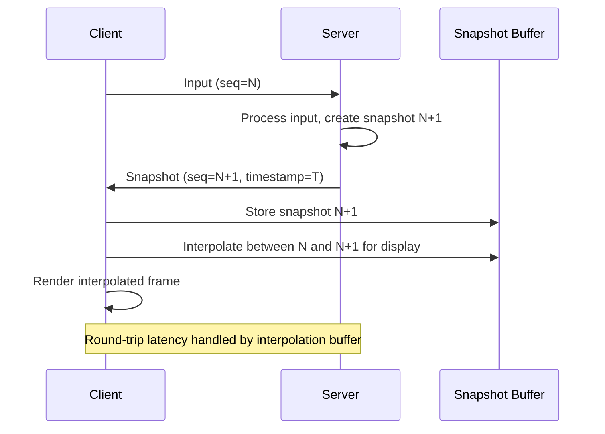

<!-- REMOVED STACK NOTICE (CDR-007): The Rust engine described here was removed from the repo; this document remains as design reference for the C/C++ port (native/littcore). -->
# NetworkingSystem

> UDP client/server, WebSocket, and ECS entity replication for multiplayer.

**Status:**  Planned -- Phase 10 of [ROADMAP.md](./ROADMAP.md).

---

## Overview

The `NetworkingSystem` provides multiplayer networking for the Litt Engine. It supports UDP for low-latency game traffic, WebSocket for browser-based play, and optional SteamNetworkingSockets for Steam-integrated games.

---

## Packet Structure

```cpp
/// Network packet header -- sent with every message.
#[derive(Clone, Copy, Debug, Pod, Zeroable)]
#[repr(C)]
pub struct PacketHeader {
    pub seq: u32,           // Sequence number
    pub timestamp: u64,     // Server timestamp (s)
    pub msg_type: u8,       // Packet type
    pub payload_len: u16,   // Payload length
}

/// Packet types
#[repr(u8)]
pub enum PacketType {
    Connect = 0,
    ConnectAck = 1,
    Snapshot = 2,
    Input = 3,
    Ack = 4,
    Disconnect = 5,
    Heartbeat = 6,
}

/// Full packet
#[derive(Clone, Debug)]
pub struct Packet {
    pub header: PacketHeader,
    pub payload: Vec<u8>,
}
```

---

## Snapshot Interpolation

The client maintains a buffer of past snapshots and interpolates between them for smooth rendering:



---

## ECS Replication

### Component Replication Mask

```cpp
#[derive(Clone, Debug)]
pub struct NetworkEntity {
    /// Unique network ID (assigned by server)
    pub net_id: u32,
    /// Server timestamp of last update
    pub server_timestamp: u64,
    /// Which components replicate for this entity
    pub replication_mask: ReplicationMask,
    /// Local prediction state
    pub predicted_state: Option<PredictedState>,
}

#[derive(Clone, Debug, Default)]
pub struct ReplicationMask {
    pub transform: bool,
    pub physics_body: bool,
    pub neural_brain: bool,
    pub behavior_state: bool,
    pub movement_intent: bool,
    pub combat_intent: bool,
    pub renderable: bool,
    pub input_state: bool,
}
```

### Authority Model

| Entity Type | Authority | Replicates To |
|-------------|-----------|---------------|
| Player | Client predicts, server authorizes | Server -> All clients |
| NPC | Server | Server -> All clients |
| World objects | Server | Server -> All clients (on spawn) |
| UI elements | Client | N/A (local only) |

---

---

## Latency Compensation

| Technique | Description | Implementation |
|-----------|-------------|----------------|
| Client prediction | Client simulates locally before server ack | PredictedState in NetworkEntity |
| Server reconciliation | Server corrects client state on ack | Snapshot interpolation buffer |
| Lag compensation | Server rewinds to player''''s past position | Server stores position history |
| Dead reckoning | Client extrapolates between snapshots | Linear velocity extrapolation |

---

## Roadmap

### Short-term (1-3 months)
- [ ] Implement `Packet` struct and serialization
- [ ] Build UDP client with sequence/ack
- [ ] Add snapshot buffer for interpolation
- [ ] Basic entity spawn/destroy replication

### Mid-term (3-12 months)
- [ ] WebSocket backend for browser target
- [ ] SteamNetworkingSockets integration
- [ ] Full component replication mask system
- [ ] Lag compensation and dead reckoning
- [ ] Matchmaking and room management

### Long-term (1-3 years)
- [ ] Server-authoritative physics reconciliation
- [ ] Anti-cheat anomaly detection (via NPU)
- [ ] Dynamic bandwidth adaptation
- [ ] Partial snapshot compression

### Experimental
-  NPU-accelerated prediction (NPC behavior prediction over network)
-  Procedural level sync via NPU-generated seeds
-  Federated learning for multiplayer balance

### Hardware-Specific
- **RDNA / AMD:** No specific networking requirements
- **Moore Threads:** Standard UDP via Vulkan-compatible socket layer
- **ARM / Mobile:** Battery-aware polling rate, WebSocket fallback
- **RISC-V:** Minimal networking stack, UDP only


