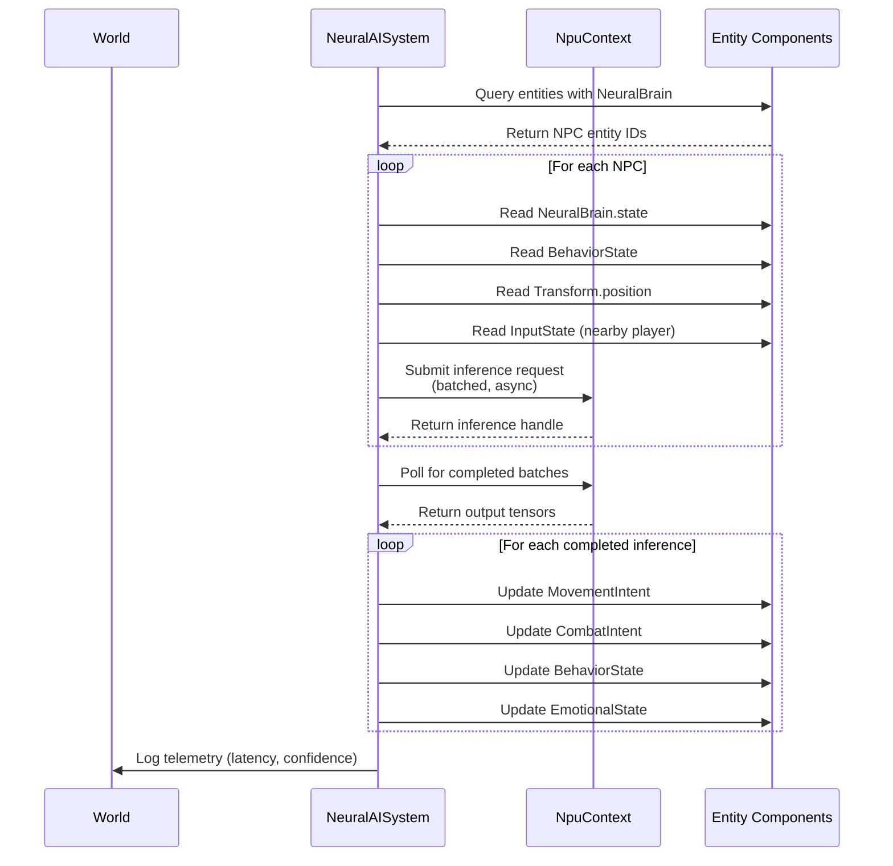

# NeuralAISystem

> NPU-driven behavior inference for NPCs, player prediction, and procedural generation.

**Status:**  Complete (Phase 6)

---

## Overview

The `NeuralAISystem` is the ECS system that drives all NPU-based AI inference. It reads observation data from entity components, submits inference requests to the NPU via the `NpuContext`, and writes the results back into entity components (`MovementIntent`, `CombatIntent`, `BehaviorState`, etc.).

All inference runs exclusively on the NPU -- no GPU or CPU fallback is permitted per [NPU_RULES.md](./NPU_RULES.md).

---

## Inference Pipeline



---

## NeuralBrain Component

The `NeuralBrain` component is attached to every AI-driven entity. It holds the model handle, inference state, and task queue.

```rust
#[derive(Clone, Debug, Pod, Zeroable)]
#[repr(C)]
pub struct NeuralBrain {
    /// Model handle loaded on the NPU
    pub model: u32,
    /// Inference state (f32 embeddings, hidden states)
    pub state: [f32; 256],
    /// Last inference timestamp (ms)
    pub last_inference_ms: f32,
    /// Inference confidence (0.0-1.0)
    pub confidence: f32,
    /// Model input shape (channels, height, width)
    pub input_shape: [u32; 3],
    /// Model output shape
    pub output_shape: [u32; 3],
    /// Pending inference tasks
    pub task_queue: [u32; 8],
    /// Task queue head/tail
    pub task_head: u32,
    pub task_tail: u32,
    /// Memory pool handle for NPU allocations
    pub memory_pool: u32,
}
```

---

## BehaviorState Component

Tracks the current high-level behavior mode of an NPC.

```rust
#[derive(Clone, Copy, Debug, Default, PartialEq)]
pub enum BehaviorMode {
    #[default]
    Idle,
    Patrol,
    Combat,
    Flee,
    Investigate,
    Hunt,
}

#[derive(Clone, Debug, Default)]
pub struct BehaviorState {
    pub mode: BehaviorMode,
    pub confidence: f32,       // 0.0-1.0 neural confidence
    pub target_entity: Option<Entity>,
    pub transition_timer: f32, // seconds until next transition
    pub emotional_vector: [f32; 8], // anger, fear, curiosity, etc.
}
```

---

## Output Components

The `NeuralAISystem` writes results into these components, which are consumed by downstream systems:

| Component | Written By | Consumed By | Purpose |
|-----------|-----------|-------------|---------|
| `MovementIntent` | NeuralAISystem | PhysicsSystem / MovementSystem | Desired velocity/direction |
| `CombatIntent` | NeuralAISystem | PhysicsSystem / RenderSystem | Target entity + action queue |
| `BehaviorState` | NeuralAISystem | All AI systems | Current behavior mode |
| `EmotionalState` | NeuralAISystem | DialogueSystem, BehaviorState | Emotional vector for decisions |

---

## System Update Loop (Pseudocode)

```rust
impl System for NeuralAISystem {
    fn update(&mut self, world: &mut World, dt: f32) {
        // 1. Collect all entities with NeuralBrain
        let npc_entities: Vec<Entity> = world.query_entities::<NeuralBrain>().collect();

        // 2. Batch inference requests
        let mut batch = NpuBatch::new(self.max_batch_size);
        for entity in npc_entities {
            let brain = world.get_component::<NeuralBrain>(entity).unwrap();
            let behavior = world.get_component::<BehaviorState>(entity).unwrap();

            // Build observation vector from world state
            let observation = self.build_observation(world, entity, behavior);

            // Submit to NPU batch
            batch.submit(entity, brain.model, observation);
        }

        // 3. Dispatch batch asynchronously
        if !batch.is_empty() {
            self.npu_context.dispatch(batch);
        }

        // 4. Poll for completed inferences
        let results = self.npu_context.poll_completed();
        for result in results {
            let entity = result.entity;
            let output = result.tensor;

            // Decode output into components
            let (movement, combat, new_behavior) = self.decode_output(output);

            world.add_component(entity, movement);
            world.add_component(entity, combat);
            world.add_component(entity, new_behavior);

            // Update confidence and timestamp
            let mut brain = world.get_component_mut::<NeuralBrain>(entity).unwrap();
            brain.confidence = output.confidence;
            brain.last_inference_ms = self.now_ms();
        }

        // 5. Log telemetry
        self.telemetry.log_inference_count(results.len());
    }
}
```

---

## NPC Adaptation

When an NPC observes repeated player patterns, it can adapt its behavior tree or update model weights:

1. **Pattern Detection**: `PlayerPredictionSystem` runs a separate NPU model that tracks player movement/combat habits
2. **Memory Storage**: Adaptations are stored in `NpcMemory` component (long-term) and `BehaviorPolicy` (shared RL weights)
3. **Behavior Tree Update**: The `NeuralAISystem` reads `NpcMemory` and adjusts decision weights in `BehaviorState`
4. **Weight Updates**: Periodic RL policy updates run via `RlTrainingSystem` on the NPU, updating shared `BehaviorPolicy` components

This creates emergent behavior where NPCs that frequently encounter the same player strategy will adapt over time.

---

## Backend Selection

The `NeuralAISystem` uses `NpuContext::select_backend()` to choose the appropriate NPU backend. For the full list of supported NPUs and selection logic, see [NPU_RULES.md](./NPU_RULES.md) section 6.

---

## Roadmap

### Short-term (1-3 months)
- [] Implement `NpuContext` with async inference queue
- [] Add `NeuralBrain` component to template entities
- [] Build observation vector construction helper
- [] Implement batched NPU dispatch

### Mid-term (3-12 months)
- [] Add `PlayerPredictionSystem` with pattern tracking
- [] Implement `NpcMemory` component for long-term adaptation
- [] Add RL policy update loop (`RlTrainingSystem`)
- [] Integrate with `DialogueSystem` for personality-driven NPC responses

### Long-term (1-3 years)
- [] Online model fine-tuning via federated learning
- [] Cross-entity emotional contagion (NPCs influence each other)
- [] Procedural narrative generation driven by NPU

### Experimental
-  Real-time NPC personality evolution across sessions
-  Emergent faction dynamics from individual NPC decisions
-  NPU-driven procedural level generation for entire dungeons

### Hardware-Specific
- **RDNA / AMD:** Leverage X DNA 2 NPU (50 TOPS) for batched multi-NPC inference
- **Moore Threads:** MUSA NPU inference with Vulkan memory sharing
- **ARM / Mobile:** Hexagon DSP + Mali-NPU hybrid for mobile NPCs
- **RISC-V:** RVV vectorized inference for edge NPC simulation

