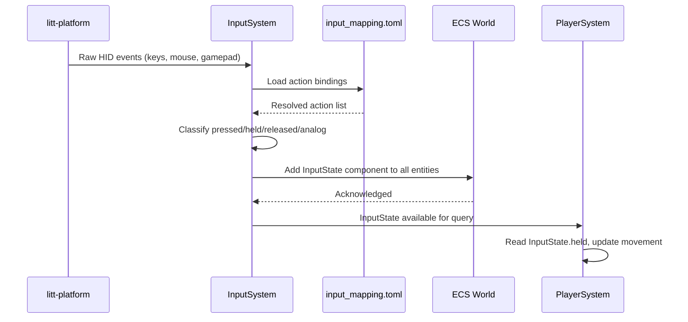

<!-- REMOVED STACK NOTICE (CDR-007): The Rust engine described here was removed from the repo; this document remains as design reference for the C/C++ port (native/littcore). -->
# InputSystem

> Input aggregation, mapping, and ECS integration for keyboard, mouse, and gamepad.

**Status:**  Designed -- `litt-platform` provides raw input; `InputSystem` ECS integration planned. See [ROADMAP.md](./ROADMAP.md#phase-4).

---

## Overview

The `InputSystem` aggregates raw HID events from `litt-platform`, resolves them into named actions via a configurable mapping table, and writes the result into `InputState` components on entities. Other systems (PlayerSystem, CameraSystem, UIOverlaySystem) read `InputState` to react to player input.

---

## Input Aggregation

Raw events are collected from the platform abstraction layer:

| Platform | Source | Type |
|----------|--------|------|
| Windows | Win32 GetMessage / Raw Input | WM_KEYDOWN, WM_MOUSEMOVE, XINPUT |
| Linux (X11) | XLib XQueryPointer / XNextEvent | KeyPress, ButtonPress, MotionNotify |
| Linux (Wayland) | wl_keyboard / wl_pointer | key, axis, button events |
| Android | AInputQueue / AInput | AINPUT_EVENT_TYPE_KEY, MOTION |
| Steam Deck | SDL2 / Steam Input API | Gamepad + gyro + trackpad |

---

## Action Mapping (TOML)

Input actions are mapped via a TOML configuration file:

```toml
# input_mapping.toml

[actions]
move_forward = "w"
move_backward = "s"
move_left = "a"
move_right = "d"
jump = "space"
sprint = "left_shift"
interact = "e"
shoot = "mouse_left"
look = "mouse"

[gamepad]
move_stick = "left_stick"
look_stick = "right_stick"
jump = "button_a"
sprint = "button_x"
shoot = "trigger_right"
menu = "button_start"

[steam_deck]
gyro_look = "gyro"
trackpad_left = "trackpad_left"
trackpad_right = "trackpad_right"
face_buttons = ["button_a", "button_b", "button_x", "button_y"]
```

---

## Action vs State

| Type | Description | Example | Duration |
|------|-------------|---------|----------|
| **Discrete** | Triggered on press/release | jump, shoot, interact | Single frame |
| **Continuous** | Held down = active | move, sprint, look | Sustained |
| **Analog** | Value from 0.0 to 1.0 | trigger, stick, touch | Sustained with magnitude |

---

## InputState Component

```rust
/// Aggregated input state written by InputSystem, read by game systems.
#[derive(Clone, Debug, Default)]
pub struct InputState {
    /// Discrete actions that were just pressed this frame
    pub pressed: Vec<Action>,
    /// Discrete actions that were just released this frame
    pub released: Vec<Action>,
    /// Continuous actions currently held
    pub held: Vec<Action>,
    /// Analog inputs (gamepad sticks, triggers, mouse delta)
    pub analog: Vec<(AnalogInput, f32)>,
    /// Mouse position in screen space (0.0-1.0)
    pub mouse_position: Vec2,
    /// Mouse delta since last frame
    pub mouse_delta: Vec2,
    /// Steam Deck gyro rotation delta
    pub gyro_delta: Vec3,
}

/// Named input actions
#[derive(Clone, Debug, PartialEq, Eq, Hash)]
pub enum Action {
    MoveForward, MoveBackward, MoveLeft, MoveRight,
    Jump, Sprint, Interact, Shoot,
    MenuUp, MenuDown, MenuLeft, MenuRight, MenuConfirm, MenuCancel,
    Screenshot, Pause,
}

/// Analog input sources
#[derive(Clone, Debug, PartialEq, Eq, Hash)]
pub enum AnalogInput {
    LeftStickX, LeftStickY,
    RightStickX, RightStickY,
    LeftTrigger, RightTrigger,
    MouseX, MouseY,
    GyroX, GyroY, GyroZ,
}
```

---

## System Update Loop



---

## Steam Deck Profile

The Steam Deck has unique input sources that require special handling:

| Input | Source | Mapped To |
|-------|--------|-----------|
| Left gyro | IMU | Look yaw/pitch |
| Right gyro | IMU | Camera rotation |
| Left trackpad | Touch | Menu navigation / touch aim |
| Right trackpad | Touch | Map / radial menu |
| Face buttons | HID | jump (A), shoot (B), interact (X), sprint (Y) |
| LB/RB | HID | Melee / block |
| D-pad | HID | Weapon select / quick items |

---

## ECS Integration

```rust
impl System for InputSystem {
    fn update(&mut self, world: &mut World, _dt: f32) {
        // 1. Poll raw input from platform
        let raw = self.platform.poll_input();

        // 2. Resolve raw events to named actions
        let state = self.mapping.resolve(raw);

        // 3. Write InputState to all entities (or a dedicated InputEntity)
        for entity in world.query_entities_with::<Player, Transform>() {
            world.add_component(entity, InputState {
                pressed: state.pressed.clone(),
                held: state.held.clone(),
                analog: state.analog.clone(),
                mouse_position: state.mouse_position,
                mouse_delta: state.mouse_delta,
                gyro_delta: state.gyro_delta,
                released: state.released.clone(),
            });
        }
    }
}
```

---

## Roadmap

### Short-term (1-3 months)
- [ ] Implement `InputState` component
- [ ] Build TOML input mapping parser
- [ ] Wire `litt-platform` raw input to `InputSystem`
- [ ] Add discrete/continuous/analog classification

### Mid-term (3-12 months)
- [ ] Steam Deck gyro + trackpad profile
- [ ] Input rebinding UI (via UIOverlaySystem)
- [ ] Input recording/playback for debugging
- [ ] Controller vibration / haptic feedback

### Long-term (1-3 years)
- [ ] Cloud-synced input profiles
- [ ] Input prediction for networking
- [ ] Adaptive input (accessibility profiles)

### Experimental
-  Voice command input via NPU
-  Eye-tracking camera control
-  Gesture recognition via NPU

### Hardware-Specific
- **RDNA / AMD:** None specific -- input is CPU-bound
- **Moore Threads:** Standard HID via Vulkan-compatible input layer
- **ARM / Mobile:** Touch input, gyroscope, accelerometer
- **RISC-V:** Standard HID, no gyro/accelerometer on most boards

