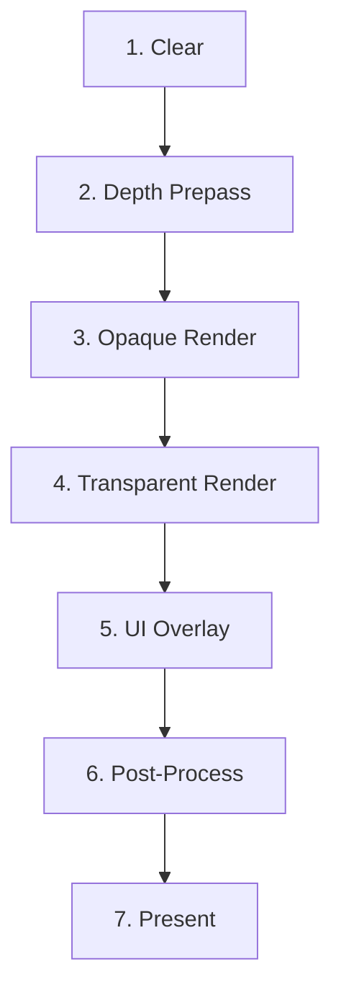

# Frame Graph

> Complete frame graph with pass ordering and shader compilation details.

## Pass Ordering

| Pass | Description | ECS Components Read |
|------|-------------|-------------------|
| Clear | Clear color, depth, stencil | — |
| Depth Prepass | Depth-only for occlusion culling | `Transform`, `Mesh` |
| Opaque Render | Main scene rendering | `Renderable`, `Transform`, `Mesh`, `Material`, `Light`, `Camera` |
| Transparent Render | Translucent materials, particles | `Renderable`, `Transform`, `Mesh`, `Material` |
| UI Overlay | HUD, menus, debug overlays | `UIOverlay`, `UIText`, `UIButton` |
| Post-Process | FidelityFX (FSR, CAS, denoise) | — |
| Present | Swapchain present | — |

## Shader Compilation

All shaders are compiled at build time via `build.rs`:

| Backend | Source | Output | Tool |
|---------|--------|--------|------|
| Vulkan | GLSL (.glsl) | SPIR-V (.spv) | glslangValidator |
| DX12 | HLSL (.hlsl) | DXIL (.dll) | dxc.exe |

## Shader Sources

| Shader | File | Backend |
|--------|------|---------|
| raygen | `shaders/pathtracer/raygen.rgen.glsl` | Vulkan |
| chit | `shaders/pathtracer/chit.rchit.glsl` | Vulkan |
| miss | `shaders/pathtracer/miss.rmiss.glsl` | Vulkan |
| mesh vert | `shaders/mesh.vert.glsl` | Both |
| mesh frag | `shaders/mesh.frag.glsl` | Both |
| tonemap | `shaders/compute/tonemap.comp.glsl` | Both |
| TAA | `shaders/compute/taa.comp.glsl` | Both |
| FSR 3 create | `shaders/fidelityfx/fsr3_create.comp.glsl` | Both |
| FSR 3 compensate | `shaders/fidelityfx/fsr3_compensate.comp.glsl` | Both |
| FSR 3 upscaler | `shaders/fidelityfx/fsr3_upscaler.comp.glsl` | Both |
| FSR 3 framegen | `shaders/fidelityfx/fsr3_framegen.comp.glsl` | Both |
| FSR 4 upscaler | `shaders/fidelityfx/fsr4_upscaler.comp.glsl` | Both |
| FSR 4 framegen | `shaders/fidelityfx/fsr4_framegen.comp.glsl` | Both |
| CAS | `shaders/fidelityfx/cas.comp.glsl` | Both |
| Ray Reconstruction | `shaders/fidelityfx/ray_reconstruction.comp.glsl` | Both |
| Denoiser diffuse | `shaders/fidelityfx/denoiser_diffuse.comp.glsl` | Both |
| Denoiser specular | `shaders/fidelityfx/denoiser_specular.comp.glsl` | Both |
| XESS 3 | `shaders/fidelityfx/xess3_framegen.comp.glsl` | Both |

## Roadmap

### Short-term
- [ ] Add occlusion culling to depth prepass
- [ ] Add VRS (variable rate shading) support

### Hardware-Specific
- **RDNA / AMD:** Wave32 compute for post-process, async compute for FidelityFX
- **Moore Threads:** Vulkan 1.3 compute shader optimization
- **ARM / Mobile:** Reduced post-process passes for battery
- **RISC-V:** CPU software fallback for post-process
