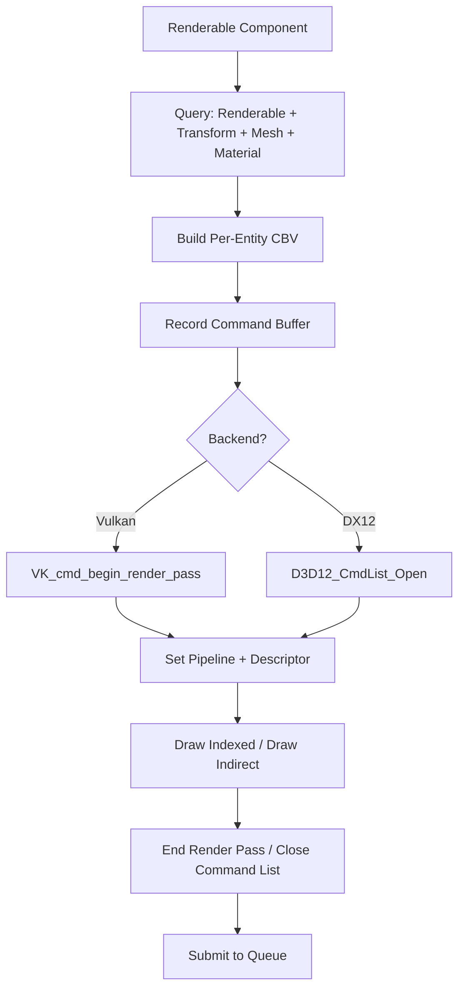
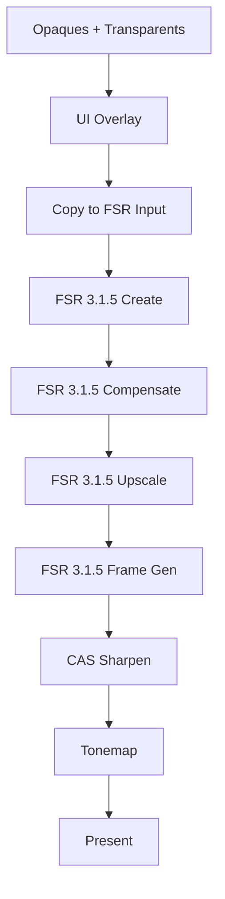

# RenderSystem

> ECS-driven rendering pipeline bridging entity components to GPU command buffers.

**Status:**  Designed -- integration with `litt-renderer` and `litt-pathtracer` planned. See [ROADMAP.md](./ROADMAP.md#phase-4).

---

## Overview

The `RenderSystem` is the ECS system responsible for translating entity components into GPU draw commands. It reads `Renderable`, `Transform`, `Mesh`, `Material`, and `Light` components, records command buffers for both Vulkan and DX12 backends, and submits them for rendering.

---

## ECS to GPU Pipeline



---

## Frame Graph

The render system follows a fixed frame graph order:


| Pass | Description | ECS Components Read |
|------|-------------|-------------------|
| Clear | Clear color, depth, stencil | -- |
| Depth Prepass | Depth-only pass for OCclusion Culling | `Transform`, `Mesh` |
| Opaque Render | Main scene rendering | `Renderable`, `Transform`, `Mesh`, `Material` |
| Transparent Render | Translucent materials, particles | `Renderable`, `Transform`, `Mesh`, `Material` |
| UI Overlay | HUD, menus, debug overlays | `UIOverlay`, `UIText`, `UIButton` |
| Post-Process | FidelityFX (FSR, CAS, denoise) | -- |
| Present | Swapchain present | -- |

---

## Shader Compilation

Shader compilation is handled by `build.rs` at compile time:

| Backend | Source | Output | Tool |
|---------|--------|--------|------|
| Vulkan | GLSL (.glsl) | SPIR-V (.spv) | glslangValidator / glslc |
| DX12 | HLSL (.hlsl) | DXIL (.dll) | dxc.exe |

```rust
// In build.rs
fn compile_shaders() {
    // Vulkan / GLSL -> SPIR-V
    for shader in glob("shaders/**/*.glsl") {
        compile_glsl_to_spirv(shader.path(), shader.out_path());
    }
    // DX12 / HLSL -> DXIL
    #[cfg(feature = "dx12")]
    for shader in glob("shaders/**/*.hlsl") {
        compile_hlsl_to_dxil(shader.path(), shader.out_path());
    }
}
```

---

## Transform + Mesh + Material -> Draw Call

```rust
impl System for RenderSystem {
    fn update(&mut self, world: &mut World, dt: f32) {
        // 1. Query all renderable entities
        let renders: Vec<(Entity, &Transform, &Mesh, &Material)> = world
            .query_entities_with::<Renderable, Transform, Mesh, Material>()
            .filter_map(|e| {
                let t = world.get_component::<Transform>(e)?;
                let m = world.get_component::<Mesh>(e)?;
                let mat = world.get_component::<Material>(e)?;
                Some((e, t, m, mat))
            })
            .collect();

        // 2. Sort by material (for draw call batching)
        let mut sorted = renders;
        sorted.sort_by_key(|(_, _, _, mat)| mat.albedo.to_u32());

        // 3. Record draw commands per material group
        for (entity, transform, mesh, material) in sorted {
            let cbv = self.allocate_cbv(transform, material);
            self.record_draw_command(entity, mesh, cbv);
        }

        // 4. Submit command buffer
        self.backend.submit();
    }
}
```

---

## FidelityFX Integration Point

The FidelityFX pipeline runs as the **post-process** step in the frame graph, after all ECS rendering is complete:



For FSR details, see [FSR_SUPPORT.md](./FSR_SUPPORT.md). For RDNA shader optimizations, see [AMD_OPTIMIZATION.md](./AMD_OPTIMIZATION.md).

---

## DX12 vs Vulkan Command Recording

| Aspect | Vulkan (ash) | DX12 |
|--------|-------------|------|
| Command recording | `vkCmdBeginRenderPass` + pipeline bindings | `ID3D12GraphicsCommandList::DrawIndexed` |
| Descriptor management | Descriptor sets + pools | Descriptor heaps (CBV/SRV/UAV/RTV/DSV) |
| Pipeline creation | `VkGraphicsPipelineCreateInfo` | `ID3D12Device::CreateGraphicsPipelineState` |
| Synchronization | Semaphores + fences | Fences + sync objects |
| RT pipeline | `VK_KHR_ray_tracing_pipeline` | DXR via `ID3D12Device5` |

The `RenderSystem` abstracts these differences via the `GraphicsBackend` trait ([see src/graphics.rs](../src/graphics.rs)).

---

## Roadmap

### Short-term (1-3 months)
- [] Implement `RenderSystem` with `litt-renderer` backend
- [] Add `Renderable` component to template entities
- [] Build per-entity CBV allocation
- [] Implement depth prepass + opaque pass

### Mid-term (3-12 months)
- [] Add transparent render pass
- [] Integrate UI overlay rendering
- [] Add FidelityFX post-process chain
- [] Implement DX12 command recording path

### Long-term (1-3 years)
- [] Mesh shaders for GPU-driven tessellation
- [] Variable rate shading (VRS)
- [] Ray tracing pipeline with FSR 4 reconstruction

### Experimental
-  GPU-driven procedural mesh generation
-  Neural shadow approximation via NPU
-  RTX-like denoising on mobile NPUs

### Hardware-Specific
- **RDNA / AMD:** Wave32 compute shaders, async compute for post-process, RGP markers
- **Moore Threads:** MUSA compute shaders, Vulkan 1.3 features
- **ARM / Mobile:** Reduced shader complexity, NEON-optimized post-process
- **RISC-V:** Software rasterizer fallback via SwiftShader


