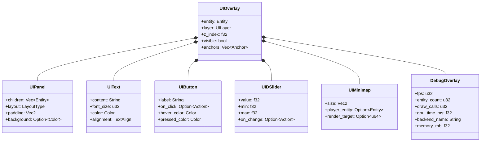
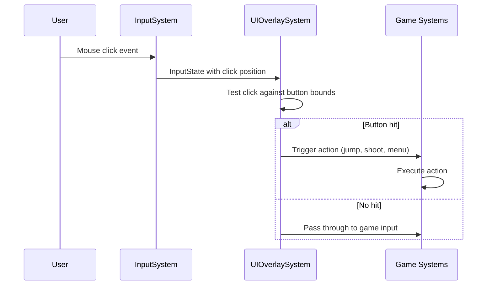

# UIOverlaySystem

> HUD, menus, debug overlays, and in-game console -- all driven by ECS components.

**Status:**  Planned -- Phase 9 of [ROADMAP.md](./ROADMAP.md).

---

## Overview

The `UIOverlaySystem` renders overlay content on top of the 3D scene. It is split into three layers:

| Layer | Purpose | Z-order |
|-------|---------|---------|
| **HUD** | Health, ammo, minimap, quest log | Above scene, below menus |
| **Menu** | Pause, settings, main menu, dialogs | Full-screen, blocks input to HUD |
| **Debug** | FPS, entity count, draw calls, GPU timer | Always on top, semi-transparent |

---

## UI Component Hierarchy



---

## Layout System

| Layout | Description | Use Case |
|--------|-------------|----------|
| **Stack** | Vertical or horizontal linear arrangement | Menus, panels |
| **Grid** | N-column grid layout | Inventory, skill trees |
| **Flex** | Wrap-aware flow layout | Dynamic HUD elements |
| **Anchor** | Position relative to screen edges/corners | Minimap, crosshair |

---

## HUD Layer

```rust
/// HUD elements rendered above the 3D scene.
#[derive(Clone, Debug)]
pub struct HUD {
    pub health_bar: Option<Entity>,
    pub ammo_display: Option<Entity>,
    pub minimap: Option<Entity>,
    pub quest_log: Option<Entity>,
    pub crosshair: Option<Entity>,
}

impl System for HUDSystem {
    fn update(&mut self, world: &mut World, dt: f32) {
        // Update health bar width based on player health
        for entity in world.query_entities_with::<Player, Health>() {
            let health = world.get_component::<Health>(entity).unwrap();
            if let Some(hud_entity) = self.hud.health_bar {
                world.add_component(hud_entity, UIText {
                    content: format!("HP: {}/{}", health.current, health.max),
                    ..Default::default()
                });
            }
        }
    }
}
```

---

## Debug Overlay

The debug overlay reads profiling data from the `GraphicsBackend` and displays it every frame:

```rust
#[derive(Clone, Debug, Default)]
pub struct DebugOverlay {
    pub fps: u32,
    pub frame_time_ms: f32,
    pub entity_count: u32,
    pub draw_calls: u32,
    pub gpu_time_ms: f32,
    pub backend_name: String,
    pub memory_mb: f32,
    pub physics_bodies: u32,
    pub npu_inferences: u32,
    pub npu_latency_ms: f32,
}
```

The debug overlay integrates with `GraphicsBackend` profiling hooks ([see src/graphics.rs](../src/graphics.rs)):

```rust
// In RenderSystem, after each frame:
let gpu_time = backend.get_gpu_timer_ms();
let draw_calls = backend.get_draw_call_count();
debug_overlay.gpu_time_ms = gpu_time;
debug_overlay.draw_calls = draw_calls;
debug_overlay.backend_name = backend.name().to_string();
```

---

## UI Update Loop

```rust
impl System for UIOverlaySystem {
    fn update(&mut self, world: &mut World, dt: f32) {
        // 1. Update all UI panels (layout, visibility)
        for panel_entity in world.query_entities::<UIPanel>() {
            self.layout_panel(world, panel_entity);
        }

        // 2. Process UI input (clicks, hovers)
        for button_entity in world.query_entities::<UIButton>() {
            if self.is_hovered(world, button_entity) {
                self.on_hover(world, button_entity);
            }
            if self.is_clicked(world, button_entity) {
                self.on_click(world, button_entity);
            }
        }

        // 3. Render all UI elements to overlay render target
        self.render_overlay(world, dt);

        // 4. Update debug overlay with backend stats
        self.update_debug_overlay(world);
    }
}
```

---

## Input Routing

UI clicks are routed through the `InputSystem`:



---

## Roadmap

### Short-term (1-3 months)
- [ ] Implement `UIOverlay` component base
- [ ] Build text rendering with font atlas
- [ ] Add debug overlay (FPS, entity count, backend name)
- [ ] Implement basic panel layout (stack)

### Mid-term (3-12 months)
- [ ] Add button, slider, and toggle widgets
- [ ] Implement grid and flex layouts
- [ ] Build pause menu and settings screen
- [ ] Add HUD elements (health, ammo, minimap)
- [ ] UI click routing through InputSystem

### Long-term (1-3 years)
- [ ] Full settings screen with all engine options
- [ ] In-game console with command history
- [ ] Cinematic subtitle system
- [ ] Localization / multi-language UI

### Experimental
-  Neural UI generation from natural language
-  Dynamic UI based on NPU-detected player skill
-  Voice-commanded menus

### Hardware-Specific
- **RDNA / AMD:** GPU-accelerated text rendering via compute shader
- **Moore Threads:** Vulkan text atlas upload optimization
- **ARM / Mobile:** Reduced UI complexity for battery life
- **RISC-V:** CPU-only UI rendering (no GPU text shaders)

